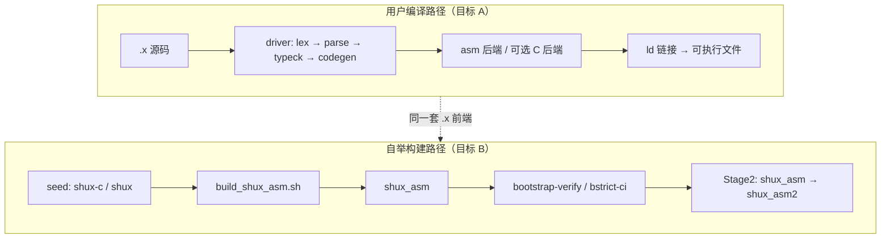

# DOC-002 自举架构全景图 v1

> 更新时间：2026-06-17  
> 状态：**定版（v1）**  
> 读者：新加入编译器/自举链路的开发者  
> 目标：**约 1 小时**理解从源码到 `shux_asm` 的主链路  
> 深度细节：见 `compiler/docs/SELFHOST.md`（运维/验收）；本文件为**全景 + 导航**

---

## 1. 一小时阅读路径（建议）

| 时段 | 章节 | 产出 |
|------|------|------|
| **0–10 min** | §2 目标 A/B/C + §3 总览图 | 知道「完全自举」指什么 |
| **10–25 min** | §4 编译前端阶段 | 能说出 lexer→link 顺序 |
| **25–40 min** | §5 构建主链 | 能画出 seed→shux_asm→stage2 |
| **40–50 min** | §6 CI 与门禁 | 知道 push 前跑什么 |
| **50–60 min** | §7 失败诊断 + §8 索引 | 会 `./tests/run-bootstrap-stage-diag.sh` |

---

## 2. 目标 A / B / C（一句话）

| 代号 | 含义 | 新人只需记住 |
|------|------|--------------|
| **A** | 用户 `.x` → 产物尽量不走 `cc -c` | 用户编译路径 asm 优先 |
| **B** | 构建**编译器本身**时不 `cc -c pipeline_gen.c` | **`shux_asm` 链接拓扑** |
| **C** | freestanding / 弱化 libc | Linux crt0 等，长期目标 |

仓库内「完全自举」≈ **语义自举（shux 编 .x 前端）+ 目标 B 在平台上成立**。允许 C 冷启动种子 `shux-c`。

---

## 3. 总览：两条链路



**主链路关键词**：`seed` → `build_asm/*.o` → `shux_asm` → `run-bootstrap-bstrict-ci.sh` →（Linux）`stage2`。

---

## 4. 编译前端阶段（单文件）

| 阶段 | 模块 | 典型失败 | 诊断 stage |
|------|------|----------|------------|
| preprocess | `preprocess.x` | `#if` 未闭合 | preprocess |
| lexer | `lexer.x` | 词法错误 | lexer |
| parser | `parser.x` | 语法 / EMIT_HEAVY emit | parser |
| typeck | `typeck.x` | 类型不匹配 | typeck |
| codegen | `codegen.x` | 发射失败 | codegen |
| asm | `backend.x` + arch | cfg-merge / SIGSEGV | asm |
| link | ld / 符号 | undefined symbol | link |

数据流：`Module` + `ASTArena` 经 pipeline glue（`pipeline_glue.c` / `pipeline.x`）串联。

---

## 5. 构建主链（自举）

### 5.1 拓扑（B-strict vs B-hybrid）

| 拓扑 | 何时 | 关键环境变量 |
|------|------|--------------|
| **full_asm / asm_only_strict** | Linux/macOS __text 全绿 | `SHUX_ASM_EXPERIMENTAL_SKIP_GEN=1` |
| **pipeline_x（B-hybrid）** | 回退 / 未全绿 | 无 SKIP_GEN，`-E` 生成 gen_driver |

详见 `compiler/docs/SELFHOST.md` §4。

### 5.2 推荐命令（复制即用）

```bash
# 1) 语义自举烟测
make -C compiler bootstrap-verify

# 2) 生产 shux_asm（B-strict 默认）
make -C compiler bootstrap-driver-bstrict

# 3) 全链 CI 等价（仓库根）
SHUX=./compiler/shux_asm ./tests/run-bootstrap-bstrict-ci.sh

# 4) push 前（bstrict + asm-73 + perf）
SHUX=./compiler/shux_asm ./tests/run-pre-push-p0.sh
```

### 5.3 Stage2（两代一致性）

| 路径 | 命令 |
|------|------|
| X Stage2 | `make -C compiler verify-selfhost-stage2` |
| B-strict Stage2 | `make -C compiler bootstrap-verify-stage2-bstrict` |

---

## 6. CI 与门禁（新人清单）

| 层级 | 入口 | 覆盖 |
|------|------|------|
| **Tier P** | `tests/run-portable-suite.sh` | 全平台同一套 .x |
| **Tier B** | `tests/run-ci-full-suite.sh` 中段 | IO/DOD/dogfood |
| **Tier A** | Linux x86_64 | `build_shux_asm` + bstrict |

**自举相关 manifest（不必全记，知道 grep `run-bootstrap-*`）：**

| ID | 门禁 | 作用 |
|----|------|------|
| BOOT-003 | `run-bootstrap-repro-gate.sh` | 1 命令复现 |
| BOOT-004 | `run-bootstrap-stage-diag-gate.sh` | log → 阶段 |
| BOOT-005 | `run-bootstrap-failure-taxonomy-gate.sh` | 失败分类 |
| BOOT-011 | `run-bootstrap-crossplatform-gate.sh` | Linux/macOS 策略 |
| BOOT-012 | `run-bootstrap-perf-gate.sh` | 编译 dogfood |

---

## 7. 失败诊断（3 步）

```bash
# 1) 保存 log
./tests/run-bootstrap-bstrict-ci.sh 2>&1 | tee /tmp/boot.log

# 2) 自动分类
./tests/run-bootstrap-stage-diag.sh /tmp/boot.log
# → SHUX_BOOT_STAGE=parser  SHUX_BOOT_REPRO=parser_second_pass

# 3) 最小复现
./tests/run-bootstrap-repro.sh "$SHUX_BOOT_REPRO"
```

taxonomy 清单：`tests/baseline/bootstrap-failure-taxonomy.tsv`。

---

## 8. 索引（深入阅读）

| 主题 | 文档 |
|------|------|
| 验收 / 拓扑 / Target B | `compiler/docs/SELFHOST.md` |
| asm 后端能力 | `compiler/src/asm/README.md` |
| mega7 / force_stub | `analysis/boot-mega7-gap.md`、`analysis/boot-force-stub-v1.md` |
| 跨平台 CI | `analysis/eng-crossplatform-ci-v1.md` |
| 质量 vs 体积门禁 | `analysis/eng-quality-gate-v1.md` |
| 路线图 | `NEXT.md` |

---

## 9. 自检（读完应能回答）

1. 目标 B 与 B-hybrid 差别？  
2. `shux_asm` 由哪条脚本产出？  
3. parser 失败时 `SHUX_BOOT_STAGE` 通常是什么？  
4. push 前本地应跑哪条脚本？  

答案：§2 / `build_shux_asm.sh` / `parser` / `run-pre-push-p0.sh`。

**DOC-002 状态：定版 ✅**
