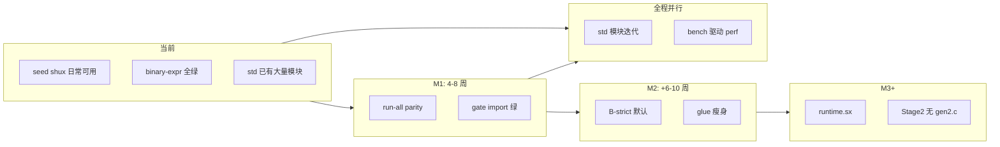

# Shux 自举阶段进度与路线图

> 文档日期：2026-05-27（M1/L5：**seed 全量 parity** `CI=1 SHUX=./compiler/shux SHUX_LINK_SHUX=./compiler/shux run-all.sh` 已绿；M2：`bootstrap-driver-bstrict` + `run-all-bstrict` 白名单已绿）  
> 依据：`compiler/docs/SELFHOST.md`、`NEXT.md`、`analysis/自举前-目标与缺口分析.md`、本地验收（`run-binary-expr.sh`、`run-bootstrap-shux-gate.sh`）及仓库测试脚本结构。  
> 目的：回答「自举还差什么、大概还要多久、何时可以主攻 std、何时可以主攻性能」。

---

## 一、执行摘要

Shux **不是从零开始自举**：语义自举（两代编译器行为一致）、C 冷启动种子、`bootstrap-driver-seed` 日常可用、asm 后端 B-strict 实验链、以及 **大量 std 模块（C 实现 + mod.sx 封装）** 已经存在。

当前仍处在 **「混合自举 / 构建拓扑过渡期」**：

| 维度 | 一句话 |
|------|--------|
| **用户程序** | 简单程序已可用 `./compiler/shux`（seed + asm 快路径）编译运行；全量回归默认仍靠 `shux-c`（C 前端）。 |
| **编译器构建** | macOS 默认 **B-hybrid**（`shux-c -E` → `pipeline_gen.c` → `cc -c`）；Linux 另有 **B-partial**（crt0）；**B-strict**（SKIP_GEN 无 `pipeline_gen.c`）在实验链上已打通但非默认。 |
| **标准库** | **现在就可以写/完善**（不阻塞自举）；瓶颈是「编译器 .sx 路径 parity」与「freestanding/弱 libc」而非 std 目录空。 |
| **性能优化** | **用户程序级**优化（如 loop 折叠）已起步；**编译器级 IR/全量优化**建议在 B-strict 默认稳定后再大规模投入。 |

**粗估剩余工期（1 名熟悉代码库的全职开发者，含测试与 CI）**：

| 里程碑 | 内容 | 保守 | 积极 |
|--------|------|------|------|
| **M1** | seed `shux` 与 `shux-c` 在 `run-all.sh` 全绿（或明确 SKIP 清单归零） | 4～8 周 | **达成**（2026-05-27：L4 与 L5 均绿；L5=`SHUX_LINK_SHUX=./compiler/shux` 不设 bootstrap 白名单） |
| **M2** | Target **B-strict** 在 macOS + Linux 成为默认构建（无 `cc -c pipeline_gen.c`） | +6～10 周 | +3～6 周 |
| **M3** | 构建链弱化 cc（仅链接/极小桩）；`runtime.c` 驱动大块迁 `.sx` | +8～16 周 | +4～8 周 |
| **M4** | 「完全自举」产品化：Stage2 不依赖 `cc -c *_gen2.c`，或 asm 全模块稳定自编译 | +12～24 周 | +6～12 周 |

以上 **M1～M4 可部分并行**（例如 M1 修 parity 的同时可继续 std 模块）。**不应**理解为「自举全部完成才能动 std」。

---

## 二、自举目标分层（A / B / C）

权威定义见 [compiler/docs/SELFHOST.md](../compiler/docs/SELFHOST.md)。此处只给完成度判断。

### 2.1 目标 A — 用户编译尽量不经过 C 代码生成

**含义**：`shux -backend asm -o …` 对用户 `.sx` 直接出机器码；链接可仍用系统 `ld`/`clang`。

| 子项 | 状态 | 说明 |
|------|------|------|
| asm 后端覆盖算术/比较/控制流 | **大部分完成** | 近期 seed 链已修 `return 1+2`、`7%3`、`1<<4` 等；`tests/run-binary-expr.sh` 在 `SHUX=./compiler/shux` 下 **已全绿**。 |
| 复杂语法（泛型/trait/多文件/LSP） | **部分完成** | `run-all.sh` 体量大，默认 `SHUX=shux-c`；`.sx` 全路径见 `run-all-sx.sh`。 |
| `-o exe` 自动链接 | **平台相关** | macOS 需 CLT；见 SELFHOST §5。 |
| 全语言特性 asm 无洞 | **未完成** | 大函数体、部分 `ExprKind`、跨模块 enc 仍有个案（历史见 SELFHOST §4.1）。 |

**结论**：A 对 **基准测试级用户程序** 接近可用；对 **全语言 + 全测试** 仍依赖 C codegen 回退或 shux-c。

### 2.2 目标 B — 构建编译器时不 `cc -c pipeline_gen.c` 等大 TU

**含义**：链接 `shux`/`shux_asm` 时不再编译 `-E` 生成的巨型 C 文件。

| 拓扑 | 状态 | 典型宿主 |
|------|------|----------|
| **B-hybrid** | **当前默认（非 Linux）** | `bootstrap-driver-seed` → `pipeline_sx.o` + C seed + `build_asm/seed_host` partial |
| **B-partial** | **Linux 可达** | crt0 + `build_asm/*.o`，本次链接无 `pipeline_gen.c` |
| **B-strict** | **实验通过，未默认** | `SHUX_ASM_EXPERIMENTAL_SKIP_GEN=1` + 两阶段 `build_shux_asm.sh`；NEXT.md §五已勾多项 |

**仍缺**：

- 默认 `make bootstrap-driver` / CI 仍以 hybrid 为主；
- `pipeline_glue.c` 仍通过 `#include` 参与编译（见 [补丁与胶水清单](./补丁与胶水清单-待从源头去除.md)）；
- 部分模块第二遍 asm 自编译依赖 **EMIT_HEAVY / 索引桩** 等机制，维护成本高。

### 2.3 目标 C — freestanding / 弱化 libc

**含义**：生成程序与构建链减少 libc 依赖。

| 子项 | 状态 |
|------|------|
| Linux crt0、panic 汇编 | **有** |
| 全面 syscall 封装、std 分层 | **长期** |
| macOS/Windows freestanding 构建 | **未做** |

**结论**：C 与自举 **不阻塞** std 丰富化；C 阻塞的是「无 libc 发行编译器/程序」。

---

## 三、已完成的主要里程碑（截至 2026-05）

以下在 `NEXT.md` 或 SELFHOST 中已有勾选或 CI 覆盖，仅作自举视角汇总：

1. **语义自举**：`make bootstrap-self` / `bootstrap-verify`；Stage2 `verify-selfhost-stage2.sh`（仍用 `cc` 编 `_gen2.c`，属语义层）。
2. **bootstrap-driver-seed**：日常 `./compiler/shux` 可链 `.sx` pipeline + asm backend partial。
3. **parser/typeck/codegen 大量迁入 `.sx`**：dep 全局槽、break/continue、import collect、`parse_expr_into` 主路径等。
4. **asm 段质量**：macOS arm64 曾达 24/24 `__text` 非空；B-strict 实验链 + pipeline/typeck/backend 第二遍。
5. **CI 门禁**：`run-bootstrap-shux-gate.sh`（hello + while + typeck）；主编译 job 含 `build_shux_asm.sh`、`bootstrap-verify`。
6. **seed 二元表达式**：`run-binary-expr.sh` + `SHUX=./compiler/shux` 全通过。
7. **最小 std 模块**（time/random/env 等）：NEXT §二已勾；与自举并行已完成。
8. **seed 重链（2026-05-27）**：`make bootstrap-driver-seed` 成功；`typeck_sx_link_alias.o` / `codegen_sx_link_alias.o` / `lexer_sx_link_alias.o` + `fix_slim_arena_gen_c.pl` 等补丁；`CI=1 SHUX=./compiler/shux ./tests/run-all.sh` 全绿。
9. **L5 真 parity（2026-05-27）**：`CI=1 SHUX=./compiler/shux SHUX_LINK_SHUX=./compiler/shux ./tests/run-all.sh` 全绿（全脚本 typeck + `-o` 均 seed，非 L4 分流）。
10. **B-strict 链（2026-05-27）**：`build_shux_asm.sh` 实验/strict 链补 `*_sx_link_alias.o`；`make bootstrap-driver-bstrict` OK；`run-all-bstrict.sh` 24 项绿（第二遍 asm 自编译仍 warning，用 seed 做 `-backend asm`）。

---

## 四、尚未完成的自举工作（按优先级）

### P0 — 阻塞「seed shux = 日常唯一编译器」

| 编号 | 缺口 | 验收建议 | 备注 |
|------|------|----------|------|
| P0-1 | **`.sx` 路径与 `shux-c` 全量 parity** | `SHUX=./compiler/shux ./tests/run-all.sh` 与 `SHUX=./compiler/shux-c` 失败集一致 | **OK**（L5：`CI=1 SHUX=./compiler/shux SHUX_LINK_SHUX=./compiler/shux ./tests/run-all.sh` ~87s；`shux-c` 基线 ~51s） |
| P0-2 | **bootstrap gate 扩展项** | `run-import.sh` / `run-compound-assign.sh` 在 seed 下绿 | **OK**（`run-bootstrap-shux-gate.sh`）；勿用失败 `shux-c -E pipeline.sx` 覆盖 `pipeline_gen.c`；`pipeline_sx.o` 默认取自 `build_asm/gen_driver/` |
| P0-3 | **多 dep / std.io import codegen** | hello、import 三类方式稳定 | SELFHOST §4.1：bootstrap shux 与 shux_sx 的 preamble 差异 |
| P0-4 | **parser/typeck 边角** | `run-typeck.sh` 负例在 `-sx` 下与 C 对齐 | 如 `return_operand_type_mismatch` 与 bool→i32 收窄策略 |

### P1 — Target B 产品化（去 hybrid 默认）

| 编号 | 缺口 | 验收 |
|------|------|------|
| P1-1 | SKIP_GEN / asm_only_strict 成为 **默认** `bootstrap-driver` | 链接命令审计无 `pipeline_gen.c` |
| P1-2 | `check_asm_o_quality.sh` 长期 **24/24** | `.asm_text_quality=1` |
| P1-3 | 大模块 asm 单编稳定 | typeck/parser/backend/pipeline 无 segfault、无 parse 截断 |
| P1-4 | 跨模块符号命名统一 | `arch_arm64_*` vs `backend_enc_*` 等 |
| P1-5 | **pipeline_glue.c 瘦身或迁入 .sx** | 减少 C TU 胶水 |

### P2 — 驱动与构建体验

| 编号 | 缺口 | 参考 |
|------|------|------|
| P2-1 | `runtime.c` 驱动逻辑迁 `.sx`（~5k 行级） | [shux-CLI重构与完全自举方案](./shux-CLI重构与完全自举方案.md) |
| P2-2 | CLI 子命令（run/build/test）全面 .sx 驱动 | 同上 §二 |
| P2-3 | `build_tool` / Makefile 默认可无 Makefile 构建 | `build.sx` |
| P2-4 | LSP 全 .sx pipeline 与 C 路径一致 | `analysis/LSP开发与shux集成分析.md` |

### P3 — 完全自举「审美意义」上的终点

| 编号 | 缺口 | 说明 |
|------|------|------|
| P3-1 | Stage2 **不** `cc -c *_gen2.c` | 当前 Stage2 仍是「`.sx` 生成 C + cc」 |
| P3-2 | 冷启动仅保留极小 C 桩或零 C | 业界常见：保留 libc + linker |
| P3-3 | Target C freestanding 发行 | 与 std 分层联动 |

---

## 五、测试矩阵：怎样算「自举过了」

建议用 **四层验收**，避免单一命令掩盖缺口：

| 层级 | 命令 | 当前理解 |
|------|------|----------|
| L1  smoke | `SHUX=./compiler/shux tests/run-bootstrap-shux-gate.sh` | **OK**（hello/while/typeck/import/compound-assign/multi-file） |
| L2 语言特性 | `SHUX=./compiler/shux tests/run-binary-expr.sh` | **OK**（bool 算术→i32：`typeck.sx`/`typeck.c` + 重链 `typeck_sx.o`） |
| L2b csv/import 链接 | `SHUX=./compiler/shux tests/run-csv.sh` | **OK**（`codegen` import 前缀 + `std/csv/csv.c` 别名 + 重链 `codegen_sx.o`） |
| L3 全量 C 对标 | `SHUX=./compiler/shux-c tests/run-all.sh` | 基线（应全绿） |
| L4 全量 .sx（M1） | `CI=1 SHUX=./compiler/shux SHUX_RUN_ALL_BOOTSTRAP_SHUX=1 ./tests/run-all.sh` | **OK**（2026-05-27，~100s）；多数 `-o` 仍经 `SHUX_LINK_SHUX=shux-c` 分流 |
| L5 真 parity | 同上，无 shux-c 分流 | **进行中**：multi-file/multi-func/toplevel-let/let-const 等已 seed；`run-io` 等仍须 shux-c |

**说明**：`run-all.sh` **故意不跑** `run-bootstrap-verify`、`run-asm` 等自举专项；完整自举需额外跑 `make bootstrap-verify`、`verify-selfhost-stage2.sh`、`build_shux_asm.sh`。

---

## 六、标准库：现在能不能写？还要等多久？

### 6.1 结论：**现在就可以写，且仓库已在写**

`std/` 已有 **30+ 模块**（io、fs、net、thread、json、compress…），见 [std/README.md](../std/README.md) 与 [std标准库全量清单与优先级](./std标准库全量清单与优先级.md)。

自举未完成 **不会阻止**：

- 新增 `std.*` 模块（C 实现 + `mod.sx` + `tests/run-*.sh`）；
- 完善文档、API、测试；
- 按需链接原则下的「丰富 std」。

### 6.2 自举会影响的 std 工作方式

| 工作类型 | 是否等自举 | 原因 |
|----------|------------|------|
| 业务向 API（time、encoding、crypto…） | **不等** | 走 shux-c 或 hybrid shux 即可开发测试 |
| `.sx` 原生实现（少 C） | **部分等** | 需 .sx codegen/asm 覆盖所用语法 |
| `std.io.driver` 真异步 | **部分等** | 依赖运行时与 I/O 契约稳定 |
| freestanding std 子集 | **等 Target C** | 不能假设 libc |
| 编译器自举用 std | **等 M1/M2** | 编译器构建希望少依赖 C std |

### 6.3 建议 std 节奏（与 NEXT 对齐）

1. **自举并行期（现在～M1）**：修 **parity** 时顺带修 import/io 相关 std 链接；优先 **process 扩展（spawn/pipe）**、**io.driver** 非桩路径（见 [舒IO实现路线图](./舒IO实现路线图.md)）。
2. **B-strict 稳定后（M2）**：加大 **.sx 实现** 比例，减少 extern C。
3. **Target C 阶段**：做 **core/std 硬分层**、嵌入式子集。

**粗估「std 达到 Zig 标准库 70% 易用覆盖面」**：与自举 **弱相关**，若 1 FTE 专注 std，约 **6～12 个月** 持续迭代（模块多、测试量大），非自举单一卡点。

---

## 七、性能优化：现在能不能做？还要等多久？

### 7.1 分两类

| 类型 | 现在能否做 | 说明 |
|------|------------|------|
| **A. 生成代码质量**（循环、常量传播、内联、寄存器分配） | **可以，但应定点** | 已有 `try_fold_count_up_while`；[perf-vs-zig-baseline.md](./perf-vs-zig-baseline.md) 记录 fold 前后 ~500x 差距 |
| **B. std 运行时性能**（net/io/thread） | **可以** | [std.net性能压榨与超越Zig](./std.net性能压榨与超越Zig.md) 等；multishot 等为可选 |
| **C. 编译器自身编译速度** | **建议 M2 后** | 自举链调试成本高 |
| **D. 全函数 IR/SSA 管道** | **建议 M1 稳定后立项** | 见 [阶段8-优化与体积分析](./阶段8-优化与体积分析.md)、NEXT §五 |

### 7.2 与自举的依赖关系

- **不依赖**自举完成：benchmark 驱动、单点 peephole、std.net/io 调优、loop 折叠类模式扩展。
- **强依赖** asm 后端稳定：否则优化落在 C 路径，seed 用户看不到。
- **强依赖** B-strict：否则 perf 对比会在 hybrid/C/asm 多路径间漂移。

### 7.3 建议节奏

1. **现在**：维持 `tests/run-perf-baseline.sh --bench`；每修一个 asm 洞补一条 bench。
2. **M1 后**：扩展 fold/常量传播到更多 while/for 形态；比较 opt 与 `-backend c -O2`。
3. **M2 后**：IR 阶段 3 最小管道（SSA 可选）、内联策略与体积报告。
4. **std 性能**：按 [接下来做什么-性能压榨与新std](./接下来做什么-性能压榨与新std.md) — **benchmark 触发** 再深挖 multishot/DPDK。

**粗估「用户程序性能对标 cc -O2（通用 loop/arithmetic）」**：在 M1+M2 后 dedicated **2～4 个月**（非全语言）；全语言 + LTO 级 **6～12 个月**。

---

## 八、推荐路线图（2026 Q2～Q4 视角）

### 阶段 0（立即～2 周）

- 修 **P0-2** import gate（seed 诊断输出或改测试兼容 silent success）。
- 维护 **seed 二元/return/typeck** 边角（本轮已修 MOD/SHIFT/LOGNOT 类问题）。
- 文档：每次 gate 变化更新本文 §五表格。

### 阶段 1（M1，约 1～2 月）

- `SHUX=./compiler/shux` 跑 `run-all.sh`，建立 **失败清单 → 逐个消**。
- 统一 bootstrap 与 release 默认产物（`shux` vs `shux-sx` vs `shux_asm` 用户文档）。
- std：**process/io.driver** 与 import 相关缺陷同步修。

### 阶段 2（M2，约 2～4 月累计）

- CI 默认 **B-strict** 或双轨明示（hybrid 仅 fallback）。
- `pipeline_glue.c` 拆分为可测试 `.sx` + 薄 C。
- perf：bench 套件固定 5～10 个内核 loop/算术 case。

### 阶段 3（M3+，约 4～9 月累计）

- 驱动/runtime `.sx` 化；CLI 完整子命令。
- Stage2 演进（减少 `_gen2.c` 依赖）或全 asm 构建 compiler。
- Target C 与 std 嵌入式子集（可选产品线）。

---

## 九、风险与假设（读工期必读）

1. **人力假设**：上表按 **1 FTE**；兼职或多人并行可缩短日历时间，但需专人负责 asm/typeck/parser 三角。
2. **平台差异**：macOS arm64 与 Linux x86_64 进度不一致；CI 双平台都绿才算 M1 完成。
3. **技术债**：EMIT_HEAVY、索引桩、partial link 是 **过渡方案**；若大模块 asm 再次 segfault，M2 可能反弹。
4. **测试哲学**：`run-all` 默认 shux-c 会 **高估** 自举完成度；必须以 `SHUX=./compiler/shux` 明示验收。
5. **std/perf 并行**：不会拖慢自举，但 **会占用带宽**；若团队极小，应明确主战场是 M1 还是 std。

---

## 十、相关文档索引

| 文档 | 用途 |
|------|------|
| [compiler/docs/SELFHOST.md](../compiler/docs/SELFHOST.md) | A/B/C 定义与验收命令 |
| [NEXT.md](../NEXT.md) | 可勾选任务清单 |
| [自举前-目标与缺口分析](./自举前-目标与缺口分析.md) | Target B 阻塞项历史 |
| [shux-CLI重构与完全自举方案](./shux-CLI重构与完全自举方案.md) | CLI 与 7 步路线图 |
| [补丁与胶水清单-待从源头去除](./补丁与胶水清单-待从源头去除.md) | pipeline_glue 与构建补丁 |
| [perf-vs-zig-baseline.md](./perf-vs-zig-baseline.md) | 性能基线与 fold 效果 |
| [接下来做什么-性能压榨与新std](./接下来做什么-性能压榨与新std.md) | std vs perf 优先级 |
| [std标准库全量清单与优先级](./std标准库全量清单与优先级.md) | std 模块 backlog |

---

## 十一、一句话回答四个问题

1. **还有哪些自举没完成？**  
   核心是 **M1 全量 parity**、**M2 B-strict 默认**、**M3 驱动/runtime .sx 化与 Stage2 去 gen2.c**；Target C 仍远。

2. **大概还要写多久？**  
   **日常使用级自举（M1）**：约 **1～2 个月**；**构建级完全自举（M2）**：再 **1.5～2.5 个月**；**理想终点（M3/M4）**：再 **3～6 个月** 量级（视人力与平台而定）。

3. **什么时候可以写/完善标准库？**  
   **现在就可以**；建议与 M1 并行，优先 **import/io/process** 与编译器路径交叉模块。

4. **什么时候可以写性能优化？**  
   **现在就可以做 bench 与定点优化**（loop fold、std.net）；**编译器大规模 IR/优化** 建议在 **M1 后定点、M2 后铺开**，避免在 hybrid 链上浪费调优。

---

*本文档随 gate/CI 状态更新；若 `run-import.sh` 或 `run-all` parity 有变，请修订 §五与 §八阶段 0。*
